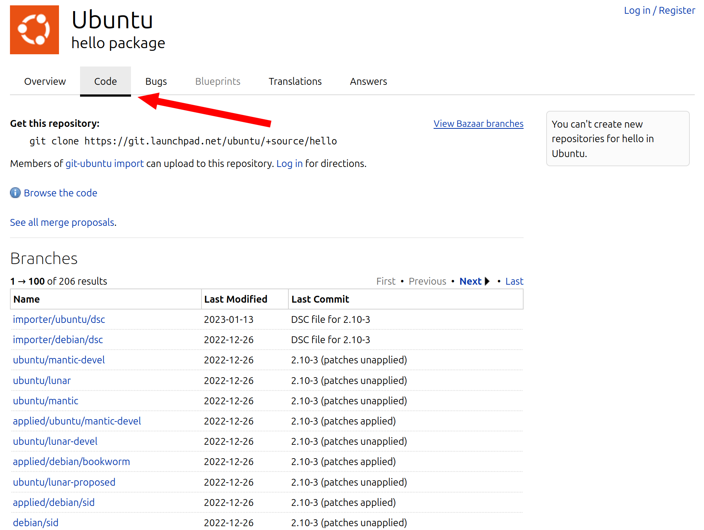

Launchpad
=========

Launchpad is a software collaboration and hosting platform similar to platforms
like `GitHub`_.

Launchpad is also the platform where the :term:`Ubuntu` project lives.
This is one of the major differences between :term:`Ubuntu' <Ubuntu>`
and :term:`Debian' <Debian>` infrastructure.

.. note::

    Although the :term:`Ubuntu` project is probably the largest userbase of Launchpad, 
    Launchpad can be used by anyone. 

Launchpad features, among others, are:

- **Bugs**: :term:`Bug Tracking System`
- **Code**: :term:`Source Code` hosting with :term:`git` or :term:`Bazaar`
  :term:`Version Control <Version Control System>` and :term:`Code Review` features
- **Answers**: community support site and knowledge base
- **Translations**: collaboration platform for localizing software 
- **Blueprints**: feature planning and specification tracking
- :term:`Ubuntu` :term:`Package` building and hosting
- Team/Group Management

While platforms like `GitHub`_ put users and groups at the top level, Launchpad
puts projects at the top level. If you take :term:`Ubuntu` as an example, you can
see that you can access it at the top level: https://launchpad.net/ubuntu.
Users and groups begin with a ``~``, for instance https://launchpad.net/~techboard.

Why not use platforms like GitHub?
----------------------------------

Although Launchpad' :term:`UI` and :term:`UX` are a bit dated, Launchpad offers an
unparalleled :term:`Ubuntu` :term:`Package` building and hosting infrastructure that
no other platform offers. Even simple requirements like building for architectures
like :term:`PowerPC`, :term:`s390x`, or :term:`RISC-V` can not be fulfilled by `GitHub`_ 
or similar platforms.

Personal Package Archive (PPA)
------------------------------

Launchpad PPAs allow you to build installable :term:`Ubuntu` :term:`Packages <Package>` for 
multiple :term:`Architectures <Architecture>` and to host them in your own software
:term:`Repository`. 

Using a PPA is straightforward; you don't need the approval of anyone, therefore users 
will have to enable it manually. See :ref:`InstallPackagesFromPPA`.

This is pretty useful when you want to test a change or show others that a change
builds successfull or is installable. Some people have the special permission to trigger
the :term:`autopkgtests <autopkgtest>` for :term:`Packages <Package>` in a PPA.

.. tip::

    You can ask in the :term:`IRC` channel ``#ubuntu-devel`` if someone can trigger 
    :term:`autopkgtests <autopkgtest>` in your PPA if you don't have the permission.

git-based workflow for the development of Ubuntu Source Packages
----------------------------------------------------------------

Launchpad hosts a :doc:`/reference/git-ubuntu` importer service that maintains
a view of the entire packaging version history of :term:`Ubuntu` 
:term:`Source Packages <Source Package>` using :term:`git` :term:`Repositories <Repository>`
with a common branching and tagging scheme. The :doc:`/reference/git-ubuntu` :term:`CLI`
provides tooling and automation that understands these :term:`Repositories <Repository>`
to make the development of :term:`Ubuntu` itself easier.

You can see the web-view of these repositories when you click on the "Code" tab of any
:term:`Source Package` on Launchpad, for example: https://code.launchpad.net/ubuntu/+source/hello

Comment Markup
--------------

Unfortunately Launchpad only regognizes a very limited set of markup patterns when you write comments. 

.. note::

    
    Support for a wider range of markup patterns is a very comman and old request/wish; 
    take for example LP: `#391780 <https://bugs.launchpad.net/launchpad/+bug/391780>`_.
    
    You can "upvote" (mark yourself as effected) or leave a comment to this bug report to
    show your support for the feature request.

    **Reminder:** Please stay civil! The Launchpad team has only limited resources.

The full range of pattern is documented `here <https://help.launchpad.net/Comments>`_. 
The most important patterns are:

URIs
~~~~

Launchpad can recognize ``http``, ``https``, ``ftp``, ``sftp``, ``mailto``,
``news``, ``irc`` and ``jabber`` :term:`URI's <URI>`.

.. note::

    ``tel``, ``urn``, ``telnet``, ``ldap`` :term:`URI's <URI>`, relative 
    :term:`URL's <URL>` like ``example.com`` and E-Mail addresses like 
    ``test@example.com`` are **NOT** recognized. 

Referencing Launchpad Bugs
~~~~~~~~~~~~~~~~~~~~~~~~~~

Synopsis
^^^^^^^^

.. code:: text

    LP: #<LP-Bug-Number>[, #<LP-Bug-Number>]...

.. note::

    This pattern is case invariant. The amount of :term:`Whitespace` can be 
    variable, but if you place :term:`Whitespace` anywhere else; the 
    :term:`Regular Expression` might not parse the input correctly. 

Examples
^^^^^^^^

.. list-table::
    :header-rows: 1

    * - Input
      - Output
    * - .. code:: text

            LP: #1
            (LP: #1)
            LP: #1, #2.
            LP:
            #1,
            #2,
            #3,
            #4
            lp: #1
            (lp: #1)
            lp: #1, #2.
            LP #1
            LP: #1 , #2
            LP: #1, #2,

            #3

      - | LP: `#1 <https://bugs.launchpad.net/ubuntu/+bug/1>`_
        | (LP: `#1 <https://bugs.launchpad.net/ubuntu/+bug/1>`_)
        | LP: `#1 <https://bugs.launchpad.net/ubuntu/+bug/1>`_, `#2 <https://bugs.launchpad.net/ubuntu/+bug/2>`_.
        | LP:
        | `#1 <https://bugs.launchpad.net/ubuntu/+bug/1>`_,
        | `#2 <https://bugs.launchpad.net/ubuntu/+bug/2>`_,
        | `#3 <https://bugs.launchpad.net/ubuntu/+bug/3>`_,
        | `#4 <https://bugs.launchpad.net/ubuntu/+bug/4>`_
        | lp: `#1 <https://bugs.launchpad.net/ubuntu/+bug/1>`_
        | (lp: `#1 <https://bugs.launchpad.net/ubuntu/+bug/1>`_)
        | lp: `#1 <https://bugs.launchpad.net/ubuntu/+bug/1>`_, `#2 <https://bugs.launchpad.net/ubuntu/+bug/2>`_.
        | LP #1
        | LP: `#1 <https://bugs.launchpad.net/ubuntu/+bug/1>`_ , #2
        | LP: `#1 <https://bugs.launchpad.net/ubuntu/+bug/1>`_, `#2 <https://bugs.launchpad.net/ubuntu/+bug/2>`_,
        |
        | #3 

Whitespaces
~~~~~~~~~~~

Launchpad will

- cut off any :term:`Whitespace` to the right and
- keep any :term:`Whitespace` to the left and
- reduce any :term:`Whitespace` between non-:term:`Whitespace` characters to 
  just one (this includes new-line characters as well).

.. note::

    Technically Launchpad passes :term:`Whitespace` through and 
    the browser just ignores the :term:`Whitespace`.

.. warning::

    Because of the above described behaviour you will have a bad time trying to write a table:

    .. list-table::
        :header-rows: 1

        * - Input
          - Output
        * - .. code:: text

                | Column 1   | Column 2 | Column 3    |
                |------------+----------+-------------|
                | Lorem      | ipsum    | dolor       |
                | sit        | amet     | consectetur |
                | adipiscing | elit     | sed         |

          - | \| Column 1 \| Column 2 \| Column 3 \|  
            | \|\-\-\-\-\-\-\-\-\-\-\-\-+\-\-\-\-\-\-\-\-\-\-+\-\-\-\-\-\-\-\-\-\-\-\-\-\|  
            | \| Lorem | ipsum | dolor \|  
            | \| sit \| amet \| consectetur \|  
            | \| adipiscing \| elit \| sed \|

    or long chunks of :term:`Whitespace` between two sections:

    .. list-table::
        :header-rows: 1

        * - Input
          - Output
        * - .. code:: text

                Here are two paragraphs with lots   
                of whitespace between them.
                
                
                
                
                But they're still just two paragraphs

          - | Here are two paragraphs with lots of whitespace between them.
            | 
            | But they're still just two paragraphs

Getting Help
------------

If you need help with Launchpad you can choose any of the following methods:

IRC Chatrooms
~~~~~~~~~~~~~

On the ``irc.libera.chat`` :term:`IRC` server exists the ``#launchpad`` channel, where you
can ask the Launchpad team and the :term:`Ubuntu` community for help.

Mailing Lists
~~~~~~~~~~~~~

If you prefer to ask for help via E-Mail, you can write to the
`launchpad-users <https://launchpad.net/~launchpad-users>`_ 
mailing list (``launchpad-users@lists.launchpad.net``).

Ask a question
~~~~~~~~~~~~~~

As mentioned above, Launchpad has a community FAQ feature (called "Answers") where
you can see other people's questions or ask one yourself. Use can use the *Answers*
feature of the Launchpad project on Launchpad itself: https://answers.launchpad.net/launchpad

Report a bug
~~~~~~~~~~~~

If you encounter any bug related to Launchpad, you can submit a bug report to the
:term:`Bug Tracking System` of the Launchpad project on Launchpad itself: 
https://bugs.launchpad.net/launchpad

Staging Environment
-------------------

Before new features are deployed to the production environment they get
deployed to a staging environment (https://qastaging.launchpad.net/) where
the changes can get tested.

You can use the staging environment, to try out :term:`Launchpad` features.

API
---

Launchpad has a Web :term:`API` that you can use to interact with its services.
This makes it easy for developer communities like :term:`Ubuntu's <Ubuntu>` to
automate specific workflows.

You can find the reference documentation for the Web :term:`API`:
https://launchpad.net/+apidoc/

The Launchpad team even created an :term:`Open Source <Open Source Software>`
ython library ``launchpadlib``: https://help.launchpad.net/API/launchpadlib

Resources
---------

- `Launchpad Home Page <Launchpad_>`_
- `The Launchpad software project on Launchpad itself <https://launchpad.net/launchpad>`_
    - `Launchpad Bug Tracker <https://bugs.launchpad.net/launchpad>`_
    - `Launchpad Questions & Answers <https://answers.launchpad.net/launchpad>`_
- `Launchpad Wiki <https://help.launchpad.net/>`_
- `Launchpad Development Wiki <https://dev.launchpad.net/>`_
- `Launchpad Blog <https://blog.launchpad.net/>`_
- :doc:`/reference/git-ubuntu`
