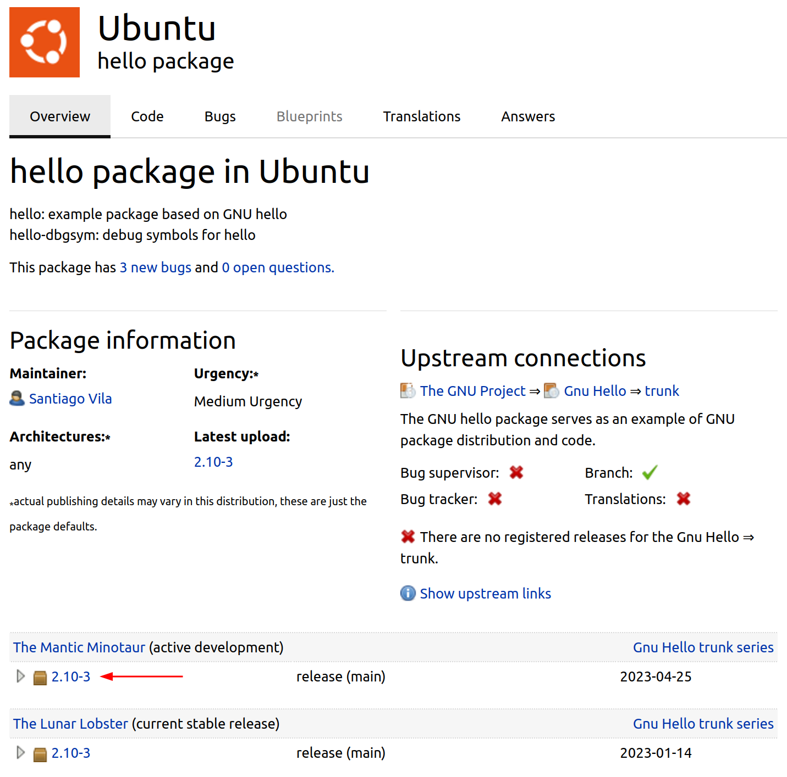
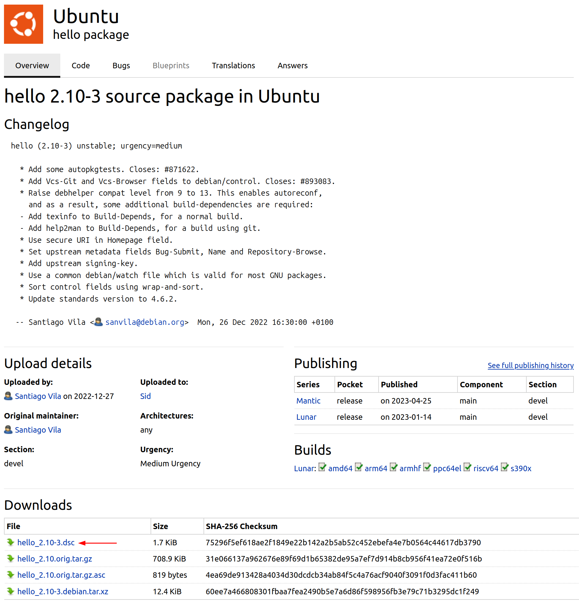

Get the source of a package
===========================

Before you can work on a :term:`source package<Source Package>` you need to get
the :term:`source code<Source Code>` of that package. This article presents
four ways to achieve this: :command:`git-ubuntu`, :command:`pull-pkg`, and
:command:`apt-get source`, and :command:`dget`.

git-ubuntu
----------

.. note::

   ``git-ubuntu`` is the modern way of working with :term:`Ubuntu`
   source packages.

.. warning::

    ``git-ubuntu`` is still in active development and these instructions
    will likely change over time. While ``git-ubuntu`` will become the
    default packaging method, for now you may encounter rough edges or
    unsupported edge cases. You can ask for help in the ``#ubuntu-devel``
    channel or `open a bug report <GitUbuntuBugs_>`_ on :term:`Launchpad`.
    Bug reports are very welcome!

Install
~~~~~~~

The following command will install ``git-ubuntu``:

.. code-block:: bash

    sudo snap install --classic --edge git-ubuntu 

Basic usage
~~~~~~~~~~~

To clone a source package git repository to a directory:

.. code-block:: bash

    git ubuntu clone PACKAGE [DIRECTORY]

To generate the :term:`orig tarballs <orig tarball>` for a given source package:

.. code-block:: bash

    git-ubuntu export-orig

Example
~~~~~~~

.. code-block:: bash

    git ubuntu clone hello 
    cd hello
    git ubuntu export-orig

You can find further information in these two blog articles (note that they are from 2017):

- `git ubuntu clone <https://ubuntu.com/blog/git-ubuntu-clone>`_
- `Git Ubuntu: More on the imported repositories <https://ubuntu.com/blog/git-ubuntu-more-on-the-imported-repositories>`_

pull-pkg
--------

The :command:`pull-pkg` command is part of the ``ubuntu-dev-tools`` package
and downloads a specific version of a source package, or the latest version
from a specified release.

Install
~~~~~~~

The following command will install ``ubtuntu-dev-tools``, which includes
:command:`pull-pkg`:

.. code-block:: bash

    sudo apt update && sudo apt install ubuntu-dev-tools

Basic usage
~~~~~~~~~~~

.. code-block:: none

    pull-pkg [OPTIONS] PACKAGE-NAME [SERIES|VERSION]

You can find further information on the manual page :manpage:`pull-pkg(1)`.

Examples
~~~~~~~~

There are convenience scripts that follow a similar syntax and set the
``OPTIONS`` for pull type and :term:`Distribution` appropriately. Here are
three examples (although there are others):

:command:`pull-lp-source`
^^^^^^^^^^^^^^^^^^^^^^^^^

* To download the latest version of the ``hello`` source package for the
  :term:`Current Release in Development` from Launchpad:

  .. code-block:: bash

      pull-lp-source hello

* To download the latest version of the ``hello`` source package for the 
  Ubuntu ``mantic`` release from Launchpad:

  .. code-block:: bash

      pull-lp-source hello mantic

* To download version ``2.10-3`` of the ``hello`` source package from Launchpad:

  .. code-block:: bash

      pull-lp-source hello 2.10-3
    
:command:`pull-ppa-source`
^^^^^^^^^^^^^^^^^^^^^^^^^^

* To download the latest version of the ``hello`` source package from the
  Launchpad :term:`Personal Package Archive` (PPA), also called ``hello``, of
  the user ``dviererbe``:

  .. code-block:: bash
    
      pull-ppa-source --ppa 'dviererbe/hello' 'hello'

* To download the latest version of the ``hello`` source package for the
  ``mantic`` release from the same Launchpad PPA:

  .. code-block:: bash

      pull-ppa-source --ppa 'dviererbe/hello' 'hello' 'mantic'

* To download version ``2.10-3`` of the ``hello`` source package for the
  ``mantic`` release from the same Launchpad PPA:

  .. code-block:: bash

      pull-ppa-source --ppa 'dviererbe/hello' 'hello' '2.10-3'

:command:`pull-debian-source`
^^^^^^^^^^^^^^^^^^^^^^^^^^^^^

* To download the latest version of the ``hello`` source package from
  :term:`Debian`:

  .. code-block:: bash

      pull-debian-source 'hello'

* To download the latest version of the ``hello`` source package for the
  ``sid`` release from Debian:

  .. code-block:: bash

      pull-debian-source 'hello' 'sid'

* To download the version ``2.10-3`` of the ``hello`` source package from Debian:

  .. code-block:: bash

      pull-debian-source 'hello' '2.10-3'

:command:`apt-get source`
-------------------------

The :term:`APT` package manager can also fetch source packages.

.. important::

   Source packages are tracked separately from
   :term:`binary packages <Binary Package>` via ``deb-src`` lines in the
   :manpage:`sources.list(5)` files. This means that you will need to add
   such a line for each :term:`repository <Repository>` you want to get source
   packages from; otherwise you will probably get either the wrong (too old/too new)
   source package versions -- or none at all.

Basic usage
~~~~~~~~~~~

.. tab-set::

    .. tab-item:: apt
        :sync: apt

        .. code-block:: none

            apt source PACKAGE-NAME

        You can find further information on the manual page :manpage:`apt(8)`.

    .. tab-item:: apt-get
        :sync: apt-get

        .. code-block:: none

            apt-get source PACKAGE-NAME

        You can find further information on the manual page :manpage:`apt-get(8)`.

Example
~~~~~~~

.. tab-set::

    .. tab-item:: apt
        :sync: apt

        .. code-block:: bash

            apt source 'hello'

    .. tab-item:: apt-get
        :sync: apt-get

        .. code-block:: bash

            apt-get source 'hello'

``dget``
--------

The :command:`dget` command is part of the ``devscripts`` package. If you call
it with the URL of a ``.dsc`` or ``.changes`` file it acts as a source package
aware :manpage:`wget(1)` and downloads all asssociated files that are listed in
the ``.dsc`` or ``.changes`` file (debian tarball, :term:`orig tarballs <orig tarball>`,
:term:`upstream` :term:`signatures <Signature>`).

Install
~~~~~~~

.. code-block:: bash

    sudo apt update && sudo apt install devscripts

Basic usage
~~~~~~~~~~~

.. code-block:: bash

    dget URL

Example
~~~~~~~

Go to Launchpad and select the package you want to download (in this example;
the latest version of the ``hello`` source package):

Next, copy the download link of the ``.dsc`` file:

Finally, call ``dget`` with the copied URL:   
   .. code-block:: bash
   
       dget https://launchpad.net/ubuntu/+archive/primary/+sourcefiles/hello/2.10-3/hello_2.10-3.dsc

Note that this works for links from Debian and Launchpad Personal Package Archives too.

You can find further information on the manual page :manpage:`dget(1)`.
