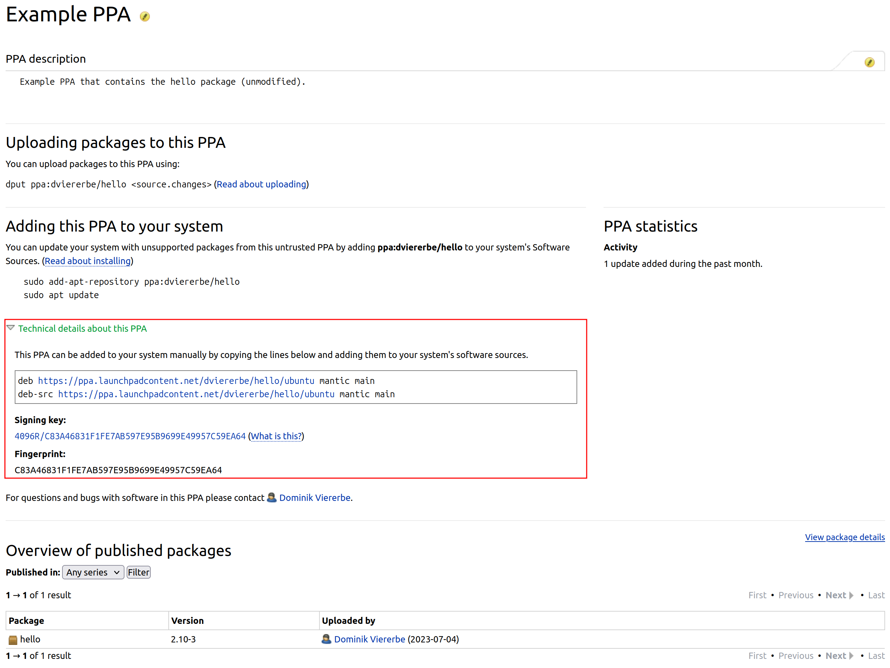
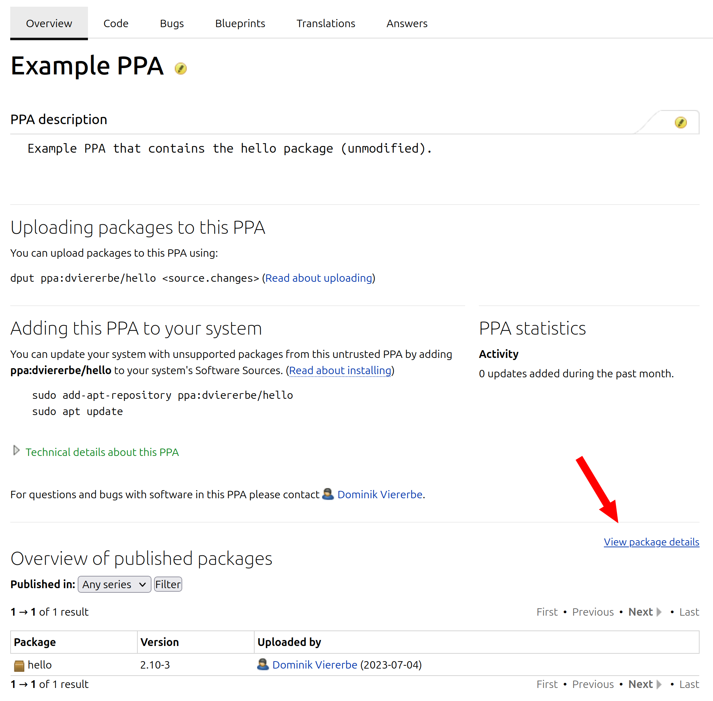
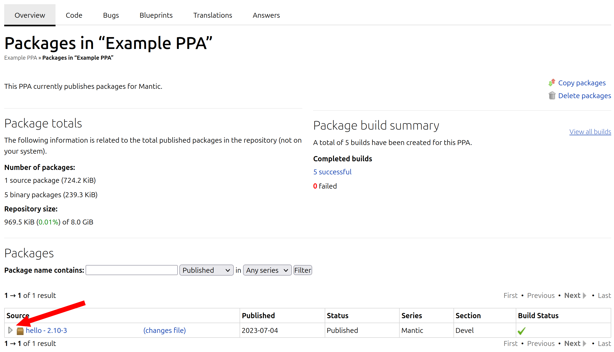

Install built packages
======================

You have a built :term:`binary packages <Binary Package>` of a
:term:`source package <Source Package>` and want to install it
(e.g. to test the packages). This article demonstrates multiple ways 
how you can achieve that.

Using your package manager
--------------------------

You can use the :manpage:`apt(8)`, :manpage:`apt-get(8)` or :manpage:`dpkg(1)`
:term:`package manager <Package Manager>` to install or uninstall
packages on an Ubuntu installation.

.. note::

    :manpage:`apt(8)` is intended to be used interactively by humans and does not
    guarantee a stable :term:`command line interface <Command Line Interface>`
    (suitable for machine-readability) while :manpage:`apt-get(8)` is intended for
    unattended usage, for example, in scripts.
    
    :manpage:`dpkg(1)` is a package manager for :term:`Debian`-based systems. It can install,
    remove, and build packages, but unlike the :term:`APT` package management systems, it
    cannot automatically download and install packages or their dependencies.

    See also the `package management <https://ubuntu.com/server/docs/package-management>`_
    guide from the :term:`Ubuntu Server` documentation for more details.

.. _install_deb_files:

Install ``.deb`` files
~~~~~~~~~~~~~~~~~~~~~~

.. tab-set::

    .. tab-item:: apt
        :sync: apt

        You can install one or multiple ``.deb`` files by using :command:`apt install` command:

        .. code-block:: none
        
            sudo apt install PACKAGE.deb...

        For example, to install the ``hello_2.10-3_amd64.deb`` binary package file
        (version ``2.10-3`` of the ``hello`` package for the ``amd64`` architecture)
        you need to run:

        .. code-block:: bash
        
            sudo apt install 'hello_2.10-3_amd64.deb'

    .. tab-item:: apt-get
        :sync: apt-get

        You can install one or multiple ``.deb`` files by using :command:`apt-get install` command:

        .. code-block:: none
        
            sudo apt-get install PACKAGE.deb...

        For example, to install the ``hello_2.10-3_amd64.deb`` binary package file
        (version ``2.10-3`` of the ``hello`` package for the ``amd64`` architecture)
        you need to run:

        .. code-block:: bash
        
            sudo apt-get install hello_2.10-3_amd64.deb

    .. tab-item:: dpkg
        :sync: dpkg

        You can install one or multiple ``.deb`` files by using :command:`dpkg --install` command:

        .. code-block:: bash
        
            sudo dpkg --install PACKAGE.deb...
        
        For example, to install the ``hello_2.10-3_amd64.deb`` binary package file
        (version ``2.10-3`` of the ``hello`` package for the ``amd64`` architecture)
        you need to run:

        .. code-block:: bash
        
            sudo dpkg --install hello_2.10-3_amd64.deb

Uninstall packages
~~~~~~~~~~~~~~~~~~

Installed packages often setup configuration files and create other data files.
When you want to uninstall a package you have to decide if you want to keep these
files or want to delete them too.

Keeping configuration files can be useful to avoid having to reconfigure a package if
it is reinstalled later, but this may have side-effects when testing to install multiple
packages.

Keep the configuration files
^^^^^^^^^^^^^^^^^^^^^^^^^^^^

.. tab-set::

    .. tab-item:: apt
        :sync: apt
    
        You can uninstall one or multiple packages and **keep** their configuration
        files by using the :command:`apt remove` command:

        .. code-block:: bash
        
            sudo apt remove PACKAGE-NAME...
        
        For example, to uninstall the currently installed ``hello`` package and
        keep its configuration files you need to run:

        .. code-block:: bash
        
            sudo apt remove hello

    .. tab-item:: apt-get
        :sync: apt-get
    
        You can uninstall one or multiple packages and **keep** their configuration
        files by using the :command:`apt-get remove` command:

        .. code-block:: bash
        
            sudo apt-get remove PACKAGE-NAME...
        
        For example, to uninstall the currently installed ``hello`` package and
        keep its configuration files you need to run:

        .. code-block:: bash
        
            sudo apt-get remove hello

    .. tab-item:: dpkg
        :sync: dpkg

        You can uninstall one or multiple packages and **keep** their configuration
        files by using the :command:`dpkg --remove` command:

        .. code-block:: bash
        
            sudo dpkg --remove PACKAGE-NAME...
        
        For example, to uninstall the currently installed ``hello`` package and
        keep its configuration files you need to run:

        .. code-block:: bash
        
            sudo dpkg --remove hello

Delete the configuration files
^^^^^^^^^^^^^^^^^^^^^^^^^^^^^^

.. tab-set::

    .. tab-item:: apt
        :sync: apt

        You can uninstall one or multiple packages and **delete** their configuration
        files by using the :command:`apt purge` command:

        .. code-block:: bash
        
            sudo apt purge PACKAGE-NAME...
        
        For example, to uninstall the currently installed ``hello`` package and
        delete its configuration files you need to run:

        .. code-block:: bash
        
            sudo apt purge hello

    .. tab-item:: apt-get
        :sync: apt-get

        You can uninstall one or multiple packages and **delete** their configuration
        files by using the :command:`apt-get purge` command:

        .. code-block:: bash
        
            sudo apt-get purge PACKAGE-NAME...
        
        For example, to uninstall the currently installed ``hello`` package and
        delete its configuration files you need to run:

        .. code-block:: bash
        
            sudo apt-get purge hello

    .. tab-item:: dpkg
        :sync: dpkg

        You can uninstall one or multiple packages and **delete** their configuration
        files by using the :command:`dpkg --purge` command:

        .. code-block:: bash
        
            sudo dpkg --purge PACKAGE-NAME...
        
        For example, to uninstall the currently installed ``hello`` package and
        delete its configuration files you need to run:

        .. code-block:: bash
        
            sudo dpkg --purge hello

.. _InstallPackagesFromPPA:

Install packages from a PPA
---------------------------

Using :command:`add-apt-repository`
~~~~~~~~~~~~~~~~~~~~~~~~~~~~~~~~~~~

The :command:`add-apt-repository` command adds a :term:`Repository` (e.g. a
:term:`Personal Package Archive` (PPA) from :term:`Launchpad`) to the
:command:`/etc/apt/sources.list.d` directory (see the :manpage:`sources.list(5)`
manual page for more details), so you can install the packages provided by the
repository like any other package from the :term:`Ubuntu Archive`.

.. code-block:: none

    sudo add-apt-repository ppa:LP-USERNAME/PPA-NAME

``LP-USERNAME``
    The username of the Launchpad user who owns the PPA.

``PPA-NAME``
    The name of the PPA.

For example, to add the Launchpad PPA with the name ``hello`` of the Launchpad user
``dviererbe`` you need to run:

.. code-block:: bash

    sudo add-apt-repository ppa:dviererbe/hello

Then, you can install, just as normal, the ``hello`` package contained in the PPA:

.. tab-set::

    .. tab-item:: apt
        :sync: apt

        .. code-block:: bash

            sudo apt install hello

    .. tab-item:: apt-get
        :sync: apt-get

        .. code-block:: bash

            sudo apt-get install hello

See the :manpage:`add-apt-repository(1)` manual page for more details.

Add PPA manually
~~~~~~~~~~~~~~~~

When you visit the web interface of the Launchpad PPA you want to add, you can
see a text reading something like "Technical details about this PPA". When you
click on the text, it will unfold and show the details you need to add the
PPA.

The steps to add the PPA are as follows:

1. Add the PPA entry to :file:`/etc/apt/sources.list.d` directory
   
   .. code-block:: bash

       sudo editor /etc/apt/sources.list.d/launchpad_ppa.sources

   Add the following lines (substituting ``LAUNCHPAD-USERNAME`` AND
   ``PPA-NAME`` for your own case) and save the file:
    
   .. code-block:: text
        
       deb https://ppa.launchpadcontent.net/LAUNCHPAD-USERNAME/PPA-NAME/ubuntu SERIES main 
       deb-src https://ppa.launchpadcontent.net/LAUNCHPAD-USERNAME/PPA-NAME/ubuntu SERIES main 
    
2. Add the of the PPA :term:`Signing Key` to ``/etc/apt/trusted.gpg.d`` directory.
   
   The following command will download the PPA signing key from the :term:`Ubuntu Keyserver`
   and store it in the correct format in the ``/etc/apt/trusted.gpg.d`` directory. Substitute
   ``SIGNING_KEY`` with the Fingerprint (see picture above) of the PPA signing key.
   
   .. code-block:: bash

       wget --quiet --output-document - \
       "https://keyserver.ubuntu.com/pks/lookup?op=get&search=0x${SIGNING_KEY,,}" \
       | sudo gpg --output /etc/apt/trusted.gpg.d/launchpad-ppa.gpg --dearmor -

3. Update the package information:
   
   .. tab-set::

      .. tab-item:: apt
          :sync: apt
  
          .. code-block:: bash
  
              sudo apt update
  
      .. tab-item:: apt-get
          :sync: apt-get
  
          .. code-block:: bash
  
              sudo apt-get update

4. Install the package from the PPA:

   .. tab-set::

      .. tab-item:: apt
          :sync: apt
  
          .. code-block:: bash
  
              sudo apt install PACKAGE-NAME
  
      .. tab-item:: apt-get
          :sync: apt-get
  
          .. code-block:: bash
  
              sudo apt-get PACKAGE-NAME

For example, here is the full script to add the Launchpad PPA named ``hello``
of the user ``dviererbe`` and install the ``hello`` package from it.

.. code-block:: bash

    sudo sh -c 'cat <<EOF > /etc/apt/sources.list.d/launchpad_ppa2.sources
    deb https://ppa.launchpadcontent.net/dviererbe/hello/ubuntu mantic main 
    deb-src https://ppa.launchpadcontent.net/dviererbe/hello/ubuntu mantic main 
    EOF'

    SIGNING_KEY=C83A46831F1FE7AB597E95B9699E49957C59EA64
    wget --quiet --output-document - \
    "https://keyserver.ubuntu.com/pks/lookup?op=get&search=0x${SIGNING_KEY,,}" \
    | sudo gpg --output /etc/apt/trusted.gpg.d/launchpad-ppa.gpg --dearmor -

    sudo apt update
    sudo apt install hello

Download the ``.deb`` files
~~~~~~~~~~~~~~~~~~~~~~~~~~~

You can also download binary packages (``.deb`` files) from a Launchpad PPA and
install them with a package manager (like demonstrated in the section :ref:`install_deb_files`).

Using :command:`pull-ppa-debs`
^^^^^^^^^^^^^^^^^^^^^^^^^^^^^^

The :command:`pull-ppa-debs` command downloads the ``.deb`` files of one specific binary
package or all binary packages, which are built by a source package in a Launchpad
PPA.

.. code-block:: none

    pull-ppa-debs --ppa LP-USERNAME/PPA-NAME [--arch ARCH] PKG-NAME [SERIES|VERSION]

\-\-ppa ``LP-USERNAME``/``PPA-NAME``
    The PPA to download the binary package(s) from.
    
    ``LP-USERNAME``
        The username of the Launchpad user who owns the PPA.

    ``PPA-NAME``
        The name of the PPA.

\-\-arch ``ARCH``
    The architecture of the binary package(s) to download. Defaults to the system
    architecture of your host machine.

``PKG-NAME``
    The name of the package to download. This can be the name of the source package
    to download all binary packages build by the source package or just the name
    of one specific binary package.

``SERIES``
    Downloads the package with the latest version that targets the Ubuntu :term:`Series`
    with the specified name. Defaults to the :term:`Current Release in Development`.

``VERSION``
    The version of the package to download.

The :command:`pull-ppa-debs` command is part of the ``ubuntu-dev-tools``
package. You need to install it, before you can use it:

.. code-block:: bash

    sudo apt install ubuntu-dev-tools

.. tip::

    The ``ubuntu-dev-tools`` package also provides the commands: 

    - ``pull-lp-debs`` (to download binary packages from Launchpad) and 
    - ``pull-debian-debs`` (to download binary packages from the Debian archive).

For example, on an :term:`amd64` machine, the following command will download the
binary package named ``hello`` and targeting ``amd64`` from the Launchpad PPA named
``hello`` of the Launchpad user ``dviererbe``:

.. code-block:: bash

    pull-ppa-deb --ppa dviererbe/hello hello

The downloaded file will be ``hello_2.10-3_amd64.deb``.

See the :manpage:`pull-pkg(1)` manual page for more details.

Using the Launchpad web interface
^^^^^^^^^^^^^^^^^^^^^^^^^^^^^^^^^

You can download ``.deb`` files from a Launchpad PPA via the web interface like this:

1. Go to the Launchpad PPA web interface and click on the link called "View package details":

2. Expand the details of the package you want to download by clicking on the little triangle next
   to the name of the package:

3. Download the file(s) you need from the "Package files" section by clicking on
   the respective links:

.. image:: ../images/how-to/install-built-packages/launchpad-ppa-webinterface4.png
    :align: center
    :width: 35 em
    :alt: Web-interface of the dviererbe/hello PPA; highlighting the technical details section.

Resources
---------

- `Ubuntu Server documentation -- Package management <https://ubuntu.com/server/docs/package-management>`_
- `Ubuntu wiki -- Installing Software <https://help.ubuntu.com/community/InstallingSoftware>`_
- manual page :manpage:`add-apt-repository(1)`
- manual page :manpage:`pull-pkg(1)`
