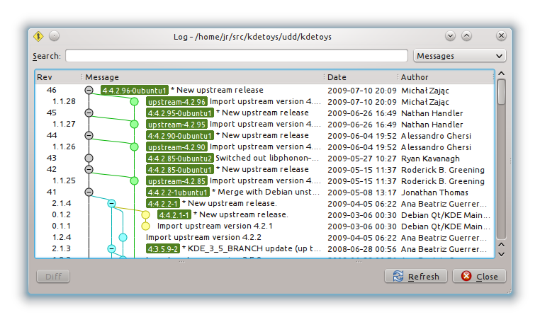
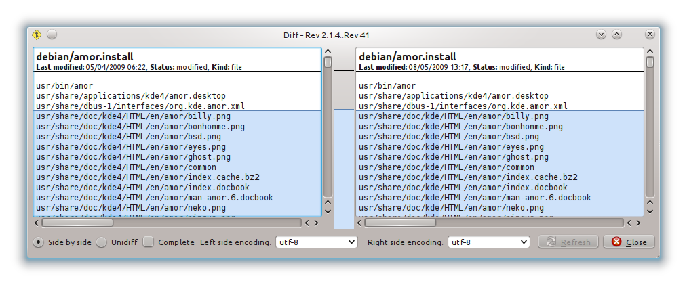

===================================================
Ubuntu Distributed Development - Introduction
===================================================

This guide focuses on packaging using the *Ubuntu Distributed Development* (UDD)
method.

*Ubuntu Distributed Development* (UDD) is a new technique for developing Ubuntu
packages that uses tools, processes, and workflows similar to generic
distributed version control system (DVCS) based software development.  The
DVCS used for UDD is Bazaar_.

Traditional Packaging Limitations
---------------------------------

Traditionally Ubuntu packages have been kept in tar archive files.  A
traditional source package is made up of the upstream source tar, a "debian" tar
(or compressed diff file for older packages) containing the packaging and a
.dsc meta-data file.  To see a traditional package run::

    $ apt-get source kdetoys

This will download the upstream source ``kdetoys_4.6.5.orig.tar.bz2``, the
packaging ``kdetoys_4.6.5-0ubuntu1.debian.tar.gz`` and the meta-data
``kdetoys_4.6.5-0ubuntu1~ppa1.dsc``.  Assuming you have dpkg-dev installed it
will extract these and give you the source package.

Traditional packaging would edit these files and upload.  However this gives
limited opportunity to collaborate with other developers, changes have to be
passed around as diff files with no central way to track them and two developers
can not make changes at the same time.  So most teams have moved to putting
their packaging in a revision control system.  This makes it easier for several
developers to work on a package together.  However there is no direct
connection between the revision control system and the archive packages so the
two must be manually kept in sync.  Since each team works in its own revision
control system a prospective developer must first work out where that is and
how to get the packaging before they can work on the package.

Ubuntu Distributed Development
------------------------------

With Ubuntu Distributed Development all packages in the Ubuntu (and Debian)
archive are automatically imported into Bazaar branches on our code hosting
site Launchpad.  Changes can be made directly to these branches in
incremental steps and by anyone with commit access.  Changes can also be made
in forked branched and merged back in with Merge Proposals when they are large
enough to need review or if they are by someone without direct commit access.

UDD branches are all in a standard location so doing a checkout is easy::

    $ bzr branch ubuntu:kdetoys

The merge history includes two separate branches, one for the upstream source
and one which adds the ``debian/`` packaging directory::

    $ cd kdetoys
    $ bzr qlog

(This command uses *qbzr* for a GUI, run ``log`` instead of ``qlog`` for
console output.)

This UDD branch of *kdetoys* shows the full packaging for each version
uploaded to Ubuntu with grey circles and the upstream source versions with
green circles.  Versions are tagged with either the version in Ubuntu such as
``4:4.2.29-0ubuntu1`` or for the upstream branch with the upstream version
``upstream-4.2.96``.  

Many Ubuntu packages are based on the packages in Debian, UDD also imports the
Debian package into our branches.  In the *kdetoys* branch above the Debian
versions from *unstable* are from the merge with blue circles while those from
*Debian experimental* are from the merge with yellow circles.  Debian
released are tagged with their version number e.g. ``4:4.2.2-1``.

So from a UDD branch you can see the complete history of changes to the package
and compare any two versions.  For example, to see the changes between version
4.2.2 in Debian and the 4.2.2 in Ubuntu use::

    $ bzr qdiff -r tag:4:4.2.2-1..tag:4:4.2.2-1ubuntu1

(This command uses *qbzr* for a GUI, run ``diff`` instead of ``qdiff`` for
console output.)

From this we can clearly see what has changed in Ubuntu compared to Debian,
very handy.

Bazaar
------

UDD branches use Bazaar, a distributed revision control system intended to be
easy to use for those familiar with popular systems such as Subversion while
offering the power of Git.

To do packaging with UDD you will need to know the basics of how to use
Bazaar to manage files.  For an introduction to Bazaar see the `Bazaar Five
Minute Tutorial
<http://doc.bazaar.canonical.com/bzr.dev/en/mini-tutorial/index.html>`_ and the
`Bazaar Users Guide
<http://doc.bazaar.canonical.com/bzr.dev/en/user-guide/index.html>`_.

Limitations of UDD
------------------

Ubuntu Distributed Development is a new method for working with Ubuntu
packages.  It currently has some notable limitations:

* Doing a full branch with history can take a lot of time and network
  resources.  You may find it quicker to do a lightweight checkout ``bzr
  checkout --lightweight ubuntu:kdetoys`` but this will need a network access
  for any further bzr operations.

* Working with patches is fiddly.  Patches can be seen as a branched revision
  control system, so we end up with RCS on top of RCS.

* There is no way to build directly from branches.  You need to create a source
  package and upload that.

* Some packages have not been successfully imported into UDD branches.  Recent
  versions of Bazaar will automatically notify you when this is the case.
  You can also check the `status of the package importer`_ manually before working 
  on a branch.

All of the above are being worked on and UDD is expected to become the main way
to work on Ubuntu packages soon.  However currently most teams within Ubuntu do
not yet work with UDD branches for their  development.  However because UDD
branches are the same as the packages in the  archive any team should be able to
accept merges against them.

.. _`status of the package importer`: http://package-import.ubuntu.com/status
